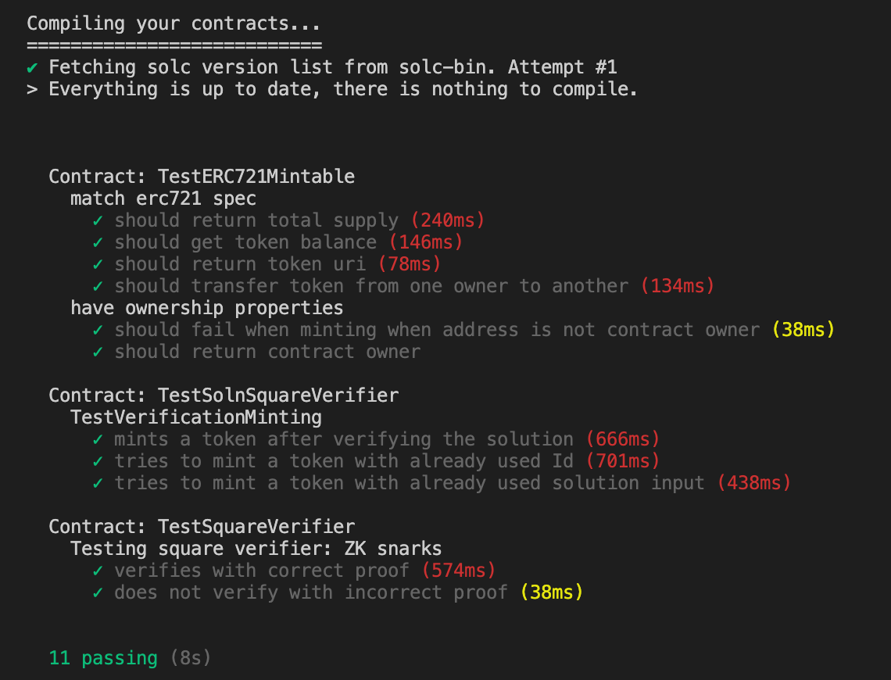
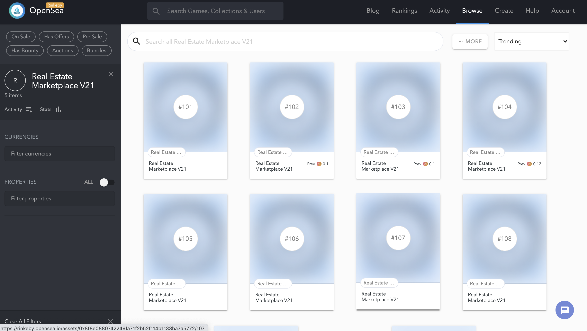

# Udacity Blockchain Capstone

The capstone will build upon the knowledge you have gained in the course in order to build a decentralized housing product. 
The tokens are minted via using ZkSNARKs and the minted tokens are put on sale on OpenSea. 

# Requirements

Truffle
```
truffle -v
Truffle v5.1.26 - a development framework for Ethereum
```
Ganache
```
Ganache CLI v6.9.1 (ganache-core: 2.10.2)
```
Solc compiler version
```
solc-compiler v^0.5.6
```

# Getting Started

1. Clone or unzip this repository.

2. Install dependencies

```
npm install
```

3. In a another terminal start ganache cli inside eth-contracts/
```
ganache-cli --gasLimit 500000000 --gasPrice 30000000000 -a 50 -m ""
```

3. Inside eth-contracts/ compile the contracts
```
 truffle compile  
```

4. Run truffle tests
```
truffle test ./test/TestERC721Mintable.js 
truffle test ./test/TestSquareVerifier.js 
truffle test ./test/TestSolnSquareVerifier.js
```




# Deployed Contracts 

```
Starting migrations...
======================
> Network name:    'rinkeby'
> Network id:      4
> Block gas limit: 10000000 (0x989680)


1_initial_migration.js
======================

   Deploying 'Migrations'
   ----------------------
   > transaction hash:    0xfe8b66cf99a417b2990bac58fac54e2429603aa00edaff95faba305612a8e1ee
   > Blocks: 0            Seconds: 8
   > contract address:    0x13a9813B5318D016783b67292e073133455A97F5
   > block number:        6817991
   > block timestamp:     1594425384
   > account:             0x61811dB971436e424A5fDF8362Cf9E97E7c823c1
   > balance:             18.675937504
   > gas used:            225237 (0x36fd5)
   > gas price:           10 gwei
   > value sent:          0 ETH
   > total cost:          0.00225237 ETH


   > Saving migration to chain.
   > Saving artifacts
   -------------------------------------
   > Total cost:          0.00225237 ETH


2_deploy_contracts.js
=====================

   Deploying 'MahiERC721Token'
   ---------------------------
   > transaction hash:    0xbdc97143f74acd50e8b2f69ea6e9a16fd7b70a1098b0d47ea7ff3defaba316fa
   > Blocks: 0            Seconds: 12
   > contract address:    0x6eC4f13f1b7e7B0825CFD145ddda7221DFB9955E
   > block number:        6817993
   > block timestamp:     1594425414
   > account:             0x61811dB971436e424A5fDF8362Cf9E97E7c823c1
   > balance:             18.645416434
   > gas used:            3009744 (0x2decd0)
   > gas price:           10 gwei
   > value sent:          0 ETH
   > total cost:          0.03009744 ETH


   Deploying 'Verifier'
   --------------------
   > transaction hash:    0xa24576ae9f577cc38902c494a0e0d5a2cc6af4d3c06b3ec6ec6d70c79c180b67
   > Blocks: 1            Seconds: 12
   > contract address:    0xdd64c101991aAfee2bA7bd686839c1cf504A6792
   > block number:        6817994
   > block timestamp:     1594425429
   > account:             0x61811dB971436e424A5fDF8362Cf9E97E7c823c1
   > balance:             18.635491884
   > gas used:            992455 (0xf24c7)
   > gas price:           10 gwei
   > value sent:          0 ETH
   > total cost:          0.00992455 ETH


   Deploying 'SolnSquareVerifier'
   ------------------------------
   > transaction hash:    0x0fc2b5f018967c9f3caca1718d4efab4bc2a7244d3d7c87e66b0d4557a4f26f6
   > Blocks: 1            Seconds: 12
   > contract address:    0x8F8E0880742249FA71f2b52F114B1133Ba7a5772
   > block number:        6817995
   > block timestamp:     1594425444
   > account:             0x61811dB971436e424A5fDF8362Cf9E97E7c823c1
   > balance:             18.601358824
   > gas used:            3413306 (0x34153a)
   > gas price:           10 gwei
   > value sent:          0 ETH
   > total cost:          0.03413306 ETH


   > Saving migration to chain.
   > Saving artifacts
   -------------------------------------
   > Total cost:          0.07415505 ETH


Summary
=======
> Total deployments:   4
> Final cost:          0.07640742 ETH
```

# Minting tokens on MyEtherWallet


# Minted tokens
https://rinkeby.opensea.io/assets/0x8f8e0880742249fa71f2b52f114b1133ba7a5772/101
https://rinkeby.opensea.io/assets/0x8f8e0880742249fa71f2b52f114b1133ba7a5772/102
https://rinkeby.opensea.io/assets/0x8f8e0880742249fa71f2b52f114b1133ba7a5772/103
https://rinkeby.opensea.io/assets/0x8f8e0880742249fa71f2b52f114b1133ba7a5772/104
https://rinkeby.opensea.io/assets/0x8f8e0880742249fa71f2b52f114b1133ba7a5772/105
https://rinkeby.opensea.io/assets/0x8f8e0880742249fa71f2b52f114b1133ba7a5772/106
https://rinkeby.opensea.io/assets/0x8f8e0880742249fa71f2b52f114b1133ba7a5772/107
https://rinkeby.opensea.io/assets/0x8f8e0880742249fa71f2b52f114b1133ba7a5772/108
https://rinkeby.opensea.io/assets/0x8f8e0880742249fa71f2b52f114b1133ba7a5772/109
https://rinkeby.opensea.io/assets/0x8f8e0880742249fa71f2b52f114b1133ba7a5772/110  


# Sold Tokens
https://rinkeby.opensea.io/assets/0x8f8e0880742249fa71f2b52f114b1133ba7a5772/101
https://rinkeby.opensea.io/assets/0x8f8e0880742249fa71f2b52f114b1133ba7a5772/102
https://rinkeby.opensea.io/assets/0x8f8e0880742249fa71f2b52f114b1133ba7a5772/103
https://rinkeby.opensea.io/assets/0x8f8e0880742249fa71f2b52f114b1133ba7a5772/104
https://rinkeby.opensea.io/assets/0x8f8e0880742249fa71f2b52f114b1133ba7a5772/105  


# Listed Tokens


# Opensea Storefront
https://rinkeby.opensea.io/assets/real-estate-marketplace-v21


# Project Resources

* [Remix - Solidity IDE](https://remix.ethereum.org/)
* [Visual Studio Code](https://code.visualstudio.com/)
* [Truffle Framework](https://truffleframework.com/)
* [Ganache - One Click Blockchain](https://truffleframework.com/ganache)
* [Open Zeppelin ](https://openzeppelin.org/)
* [Interactive zero knowledge 3-colorability demonstration](http://web.mit.edu/~ezyang/Public/graph/svg.html)
* [Docker](https://docs.docker.com/install/)
* [ZoKrates](https://github.com/Zokrates/ZoKrates)

# References 
* https://www.myetherwallet.com/interface/dashboard
* https://rinkeby.opensea.io/
* https://rinkeby.etherscan.io/address/0x5fe5163ff8c2136f3054e7b8217966f8d7ab7605